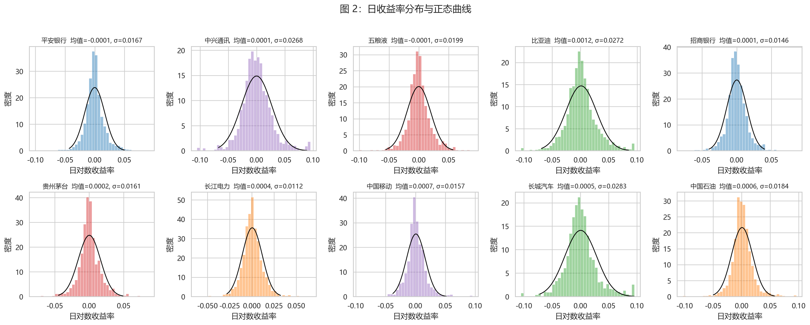
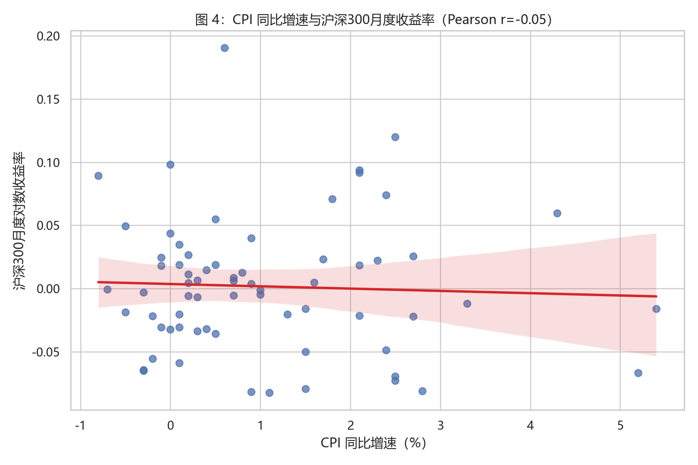
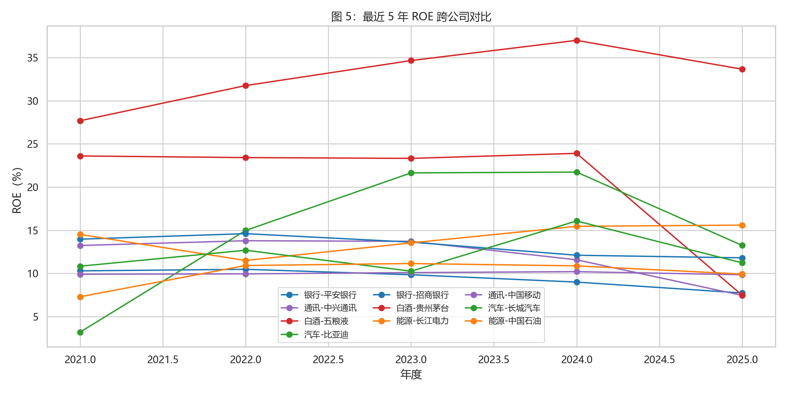

# 描述统计与可视化

统计表显示，10 只股票的收益风险差异非常明显。比亚迪年化均值最高，达到 29.82%，但年化波动率也高达 43.11%，属于高收益、高波动的成长型样本；中国移动、中国石油和长城汽车的年化均值也较高，分别约为 17.20%、15.79% 和 13.47%。平安银行和五粮液的年化均值为负，说明样本期内价格修复不足。

最大回撤方面，长城汽车、五粮液、中兴通讯和平安银行分别出现约 -70.61%、-66.62%、-61.87% 和 -59.38% 的深度回撤，而长江电力和中国移动的最大回撤仅约 -17.54% 和 -19.20%，防御属性更强。

## 归一化价格走势

图 1 可以看出，样本期内个股走势明显分化。比亚迪的归一化收盘价最终约为起点的 6.18 倍，是 10 只股票中表现最突出的样本；中国石油、长城汽车、中国移动和长江电力最终分别约为起点的 2.62 倍、2.28 倍、2.05 倍和 1.80 倍，明显强于沪深 300 约 1.17 倍的同期表现。相反，五粮液和平安银行期末仍低于起点，分别约为 0.85 倍和 0.80 倍。

## 收益率分布

图 2 与描述性统计共同说明，10 只股票的日收益率并不完全符合简单正态分布。所有股票偏度均为正，其中中国移动偏度约 0.61、长城汽车约 0.46；峰度方面，中国石油、中国移动和平安银行分别约为 5.08、5.04 和 4.59，高于正态分布基准，体现出尖峰厚尾特征。

## 相关系数热力图

图 3 显示行业内相关性具有明显差异。白酒组合五粮液与贵州茅台的相关系数约为 0.83，是样本中最高的一组；银行组合平安银行与招商银行约为 0.78，也体现出较强行业共振。汽车组合比亚迪与长城汽车约为 0.59，通信组内部的中国移动与中兴通讯相关性较弱，说明行业标签之外，公司商业模式和市场风格也会影响收益同步性。

## 宏观变量关系

图 4 中 CPI 同比增速与沪深 300 月度收益率的 Pearson 相关系数约为 -0.05，M2 同比增速与沪深 300 月度收益率的相关系数也约为 -0.05，均接近 0。这说明在 2020 年以来的样本中，单独使用 CPI 或 M2 难以解释沪深 300 的短期月度收益变化。

## ROE 对比

图 5 显示，贵州茅台最近 5 年平均 ROE 约 32.94%，2025 年仍有 33.65%，盈利能力最突出。五粮液 5 年平均 ROE 约 20.34%，但 2025 年降至 7.47%，与其股价表现承压相互印证。银行中招商银行平均 ROE 约 13.22%，高于平安银行的 9.46%；能源中长江电力平均 ROE 约 14.11%，且 2025 年达到 15.59%，与其较低波动和较小回撤形成一致的稳健特征。

