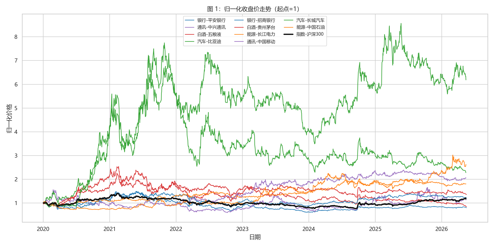

# 项目概览

本电子书是 P02a 金融数据作业的在线版本，内容与根目录下的 [`report.html`](report.html) 保持一致，并补充数据获取、清洗、存储和回归解释。项目选取 10 只 A 股，覆盖银行、白酒、汽车、能源、通讯 5 个行业；市场基准为沪深 300，补充指数为中证 500，宏观变量为 CPI 同比增速和 M2 同比增速。

本项目的核心结论是：2020 年以来样本股票表现高度分化，比亚迪收益最高但波动较大，长江电力和中国移动回撤较小、防御属性更强；白酒内部贵州茅台显著强于五粮液，银行内部招商银行强于平安银行。CAPM 结果显示，高 Beta 股票主要集中在比亚迪、中兴通讯、长城汽车和五粮液，低 Beta 股票集中在长江电力、中国移动和中国石油，但 5% 显著性水平下没有股票获得稳定 Alpha。

## 股票与行业

| 行业 | 股票 |
|---|---|
| 银行 | 平安银行、招商银行 |
| 白酒 | 贵州茅台、五粮液 |
| 汽车 | 比亚迪、长城汽车 |
| 能源 | 中国石油、长江电力 |
| 通讯 | 中国移动、中兴通讯 |

## 关键输出

- 独立报告：[`report.html`](report.html)
- 描述统计：`output/descriptive_stats.csv`
- CAPM 回归：`output/capm_results.csv`
- 图表文件：`output/fig1_normalized_prices.png` 至 `output/fig6_capm_beta.png`

