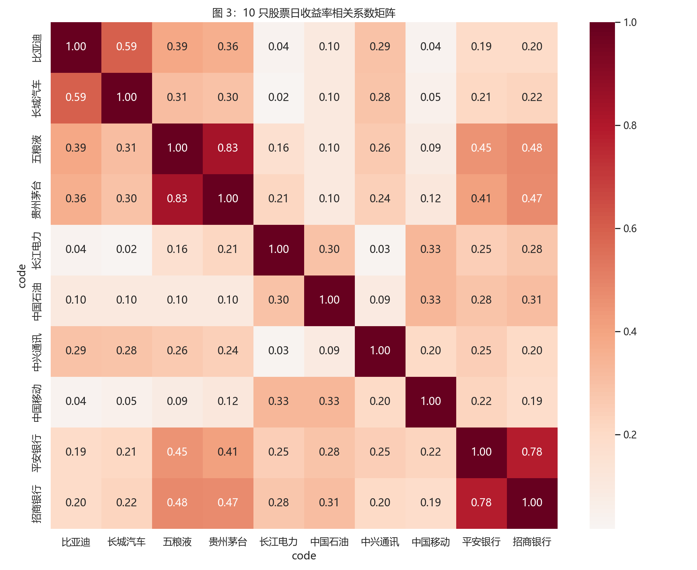
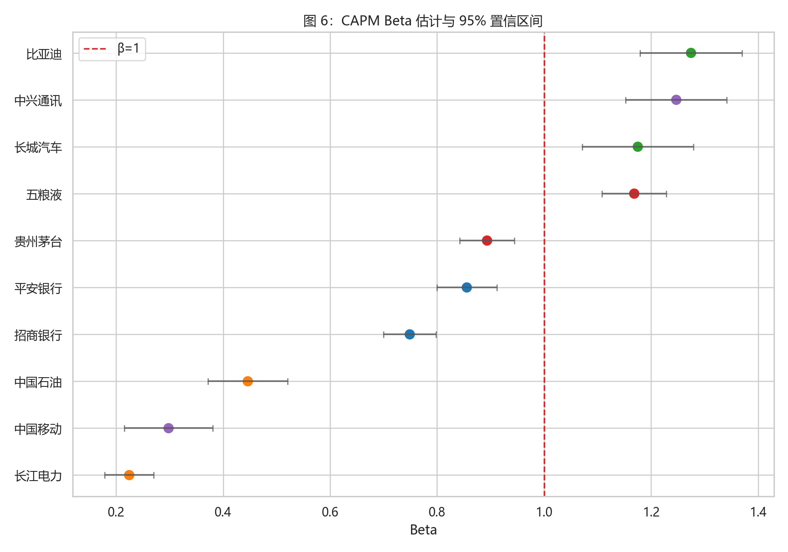

# 项目概览

本电子书整理 P01 金融数据作业的主要流程和结论。完整代码见三个 Notebook，独立分析报告见 [`report.html`](report.html)。

## 数据与方法

- 数据范围：2020-01-01 至运行当日。
- 个股范围：10 只 A 股，覆盖银行、白酒、汽车、能源、通讯 5 个行业。
- 市场基准：沪深 300。
- 宏观变量：CPI 同比增速、M2 同比增速。
- 存储方式：CSV 作为基础格式，Parquet 作为进阶格式。

## 关键输出

统计表、图形和回归结果由 `03_analysis.ipynb` 生成，图形统一保存到 `output/`。






## 运行顺序

```bash
pip install -r requirements.txt
jupyter notebook 01_download.ipynb
jupyter notebook 02_clean.ipynb
jupyter notebook 03_analysis.ipynb
python -m nbconvert --to html 03_analysis.ipynb --output report.html
quarto render
```
